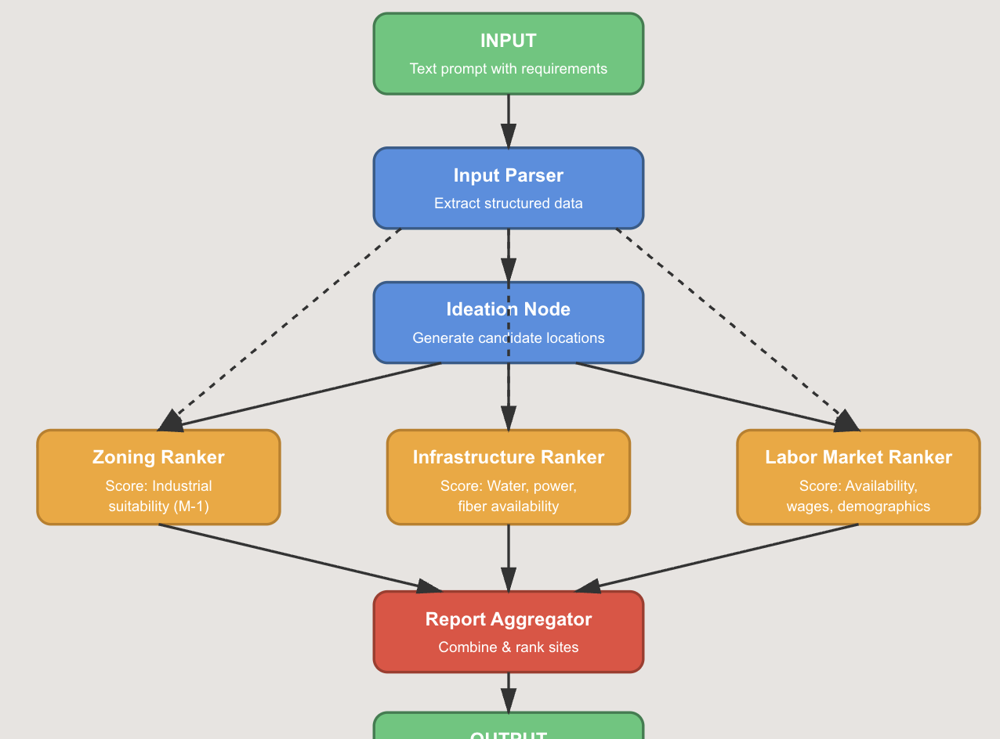

# build_agent_task
Given Build Related Task, Complete
 
## Milestone one:
  - $\textbf{Option B}$
  
Site Sourcing (Industrial/Logistics Developer)
Context: You're an industrial developer looking for logistics warehouse sites near specific
coordinates (e.g., 33.4484° N, 112.0740° W - Phoenix). Evaluate highway/interstate access
(proximity to I-10, I-17), available parcels (100+ acres, flat terrain), zoning suitability
(industrial/M-1), labor market (warehouse worker availability, wage rates), and utility
infrastructure (water, power, fiber).
Output: Ranked site recommendations with scoring and justification

Task Milestone 1
Goal: Hardcoded workflow executes end-to-end
What to build:

- Design the DAG structure to achieve the workflow goal (you decide how to break it
down)
- Hardcode 3-5+ nodes with their prompts, tools, and tasks
- Implement execution using LangGraph
- Nodes run in parallel where possible
- Include a drafting node that generates a report based on findings
- Show results (terminal/console output is fine)

Success criteria:
● ✅ Workflow executes without errors
● ✅ Parallel execution works
● ✅ All nodes complete and produce output
● ✅ Drafting node combines results into report

DAG IS as follows:

# -----------------------------
# Hardcoded model usage
Include openAI key in .env as OPENAI_API_KEY.
Include BLS key in .env as BLS_API_KEY.
# -----------------------------
